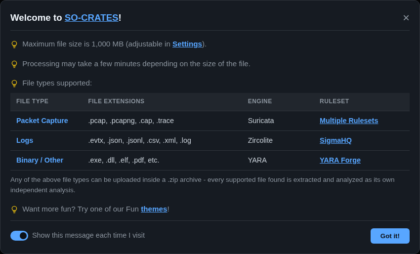
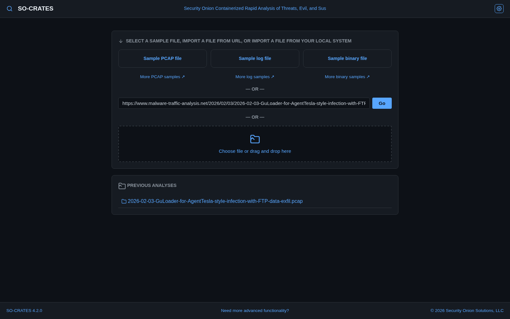
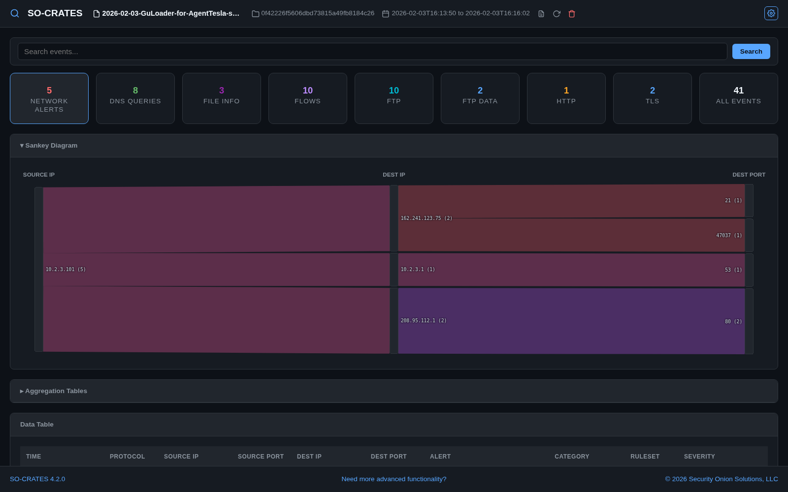
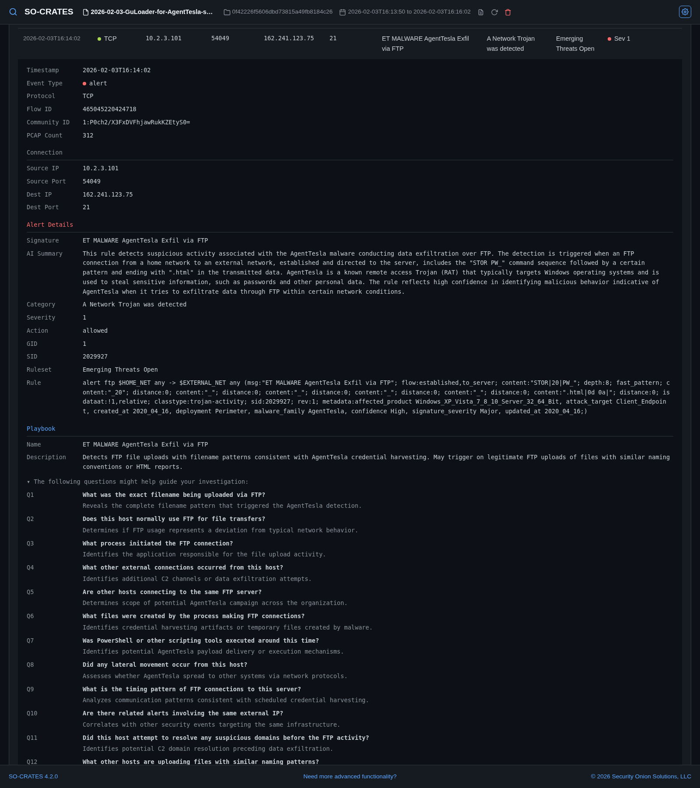
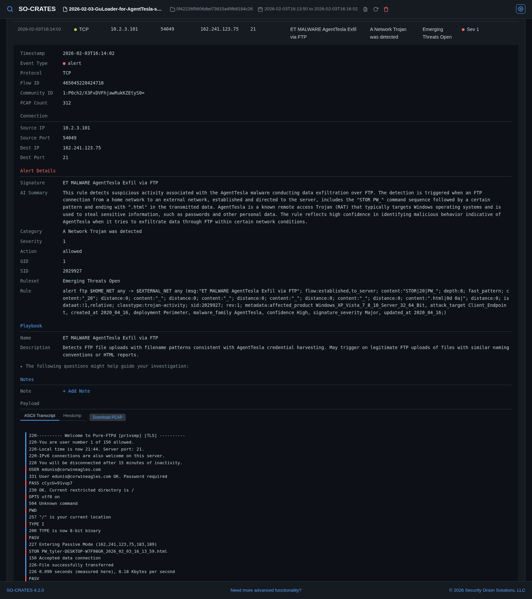
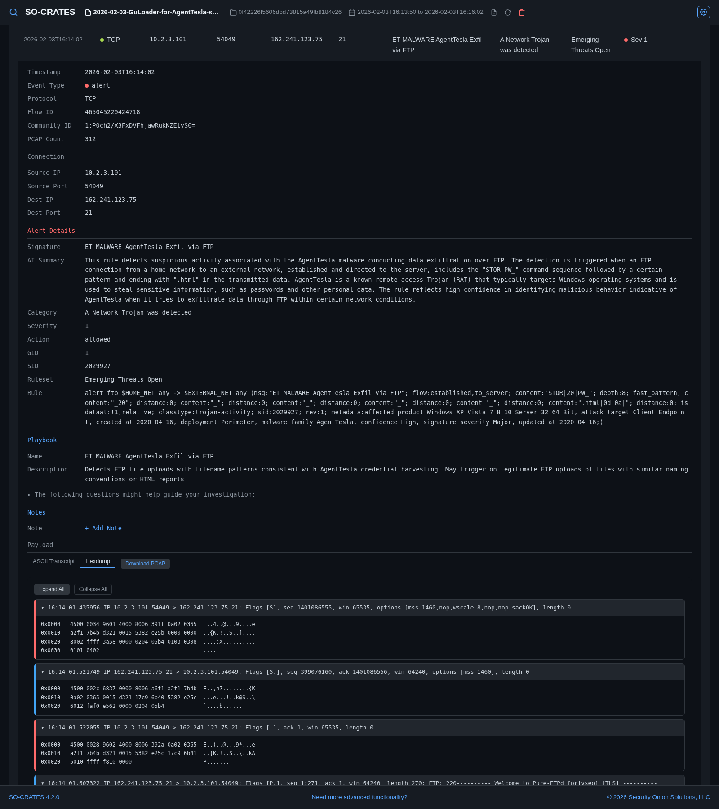
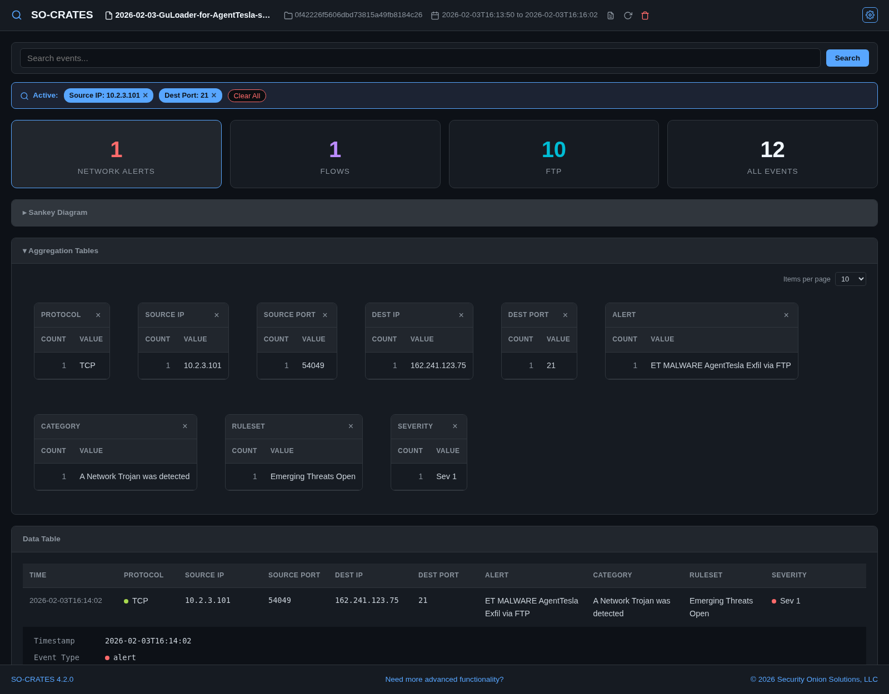

# Usage

Once you've connected to SO-CRATES in your browser, here are some of the things you can do.

## Screenshot Tour

When you first connect to SO-CRATES, a welcome window will appear with an overview of SO-CRATES:

When you dismiss the welcome window, the main screen allows you to upload a file or load a previous analysis:

After analysis, you can view network alerts, file alerts, network metadata, and extracted streams:

Clicking a value in the data table opens a pivot menu for Include/Exclude/Only filtering, Hunt, and Correlate - which searches for every other log across the capture sharing that row's community ID (the cross-tool flow-correlation hash, computed by Suricata - force-enabled in 4.1.0):

Drilling into a Suricata, Sigma, or YARA alert shows an AI-generated summary of what the rule detects, when one is available for that rule. Suricata and Sigma alerts also show a Playbook with plain-English investigation guidance for that specific detection:

You can optionally collapse the Playbook questions. You can also scroll to the bottom to see the ASCII transcript:

You can also select the hexdump view:

To slice and dice your data, expand the Aggregation Tables section and click on values that you want to filter for:

## Analyze a File

1. **Upload a file** - click "Choose File" and select a `.pcap`, `.pcapng`, `.cap`, `.trace`, `.evtx`, `.json`, `.jsonl`, `.csv`, `.xml`, `.log`, or any other file type (or a `.zip` containing one). File types are auto-detected:
   - **PCAP** files → Suricata network analysis
   - **Log files** (`.evtx`, `.json`, `.jsonl`, `.csv`, `.xml`, `.log`) → Zircolite Sigma rule detection
   - **Other files** → YARA binary scanning
2. **Load from URL** - paste a URL to a file and press **Enter** (or click **Go**). Password-protected zips from `malware-traffic-analysis.net` are auto-decrypted using the date-based password format
3. **Reopen a previous analysis** - previously analyzed files are listed on the welcome screen
4. **Reanalyze or delete an open analysis** - once an analysis is open, its header (next to the notes icon) has reanalyze and delete icons - reanalyze deletes the existing results and re-runs the pipeline in place; delete removes the analysis and returns to the welcome screen. To delete every previous analysis at once, use the Danger Zone section in Settings (Gear Menu → Settings) instead

## Navigate Results

After analysis completes, the UI displays different views depending on the file type:

**For PCAP files:**

- **Stats Grid** - clickable cards showing event counts by type (Alerts, DNS, HTTP, TLS, Flows, etc.). If you've enabled "Show protocol-anomaly noise alerts" (Gear Menu → Rules), those alerts get their own **Decoder Alerts** card instead of mixing into Network Alerts. A **DNS Heuristics** card appears immediately before the **DNS Queries** card whenever any domain in the capture trips a scoring flag; see [DNS Heuristics](#dns-heuristics) below
- **Sankey Diagram** - expand the collapsible heading to visualize network flow relationships (Source IP → Dest IP → Dest Port)
- **Aggregation Tables** - frequency counts for each column; click a value to open the [pivot menu](#pivot-menu). Each table pages through its values with Prev/Next instead of growing the page, at a size (10/25/50/100) set by the "Items per page" selector, which applies to every table in the section and persists across sessions
- **Data Table** - sortable table with expandable detail rows showing full event JSON, ASCII transcripts, and hexdumps. Every row's flow carries a community ID, and a TLS row's detail panel includes JA3/JA3S/JA4 fingerprints whenever present - both computed by Suricata automatically, no configuration needed
- **Search** - full-text search across all event data using SQLite FTS5 (falls back to `LIKE` if FTS5 is unavailable)
- **Filtering** - filter via the pivot menu's Include/Exclude/Only actions on any table cell or aggregation value; filter chips show active filters; filters persist across all tabs and the Sankey diagram

**For log files (`.evtx`, `.json`, `.jsonl`, `.csv`, `.xml`, `.log`):**

- **Sigma Alerts** - detections matched by Sigma rules, with severity, MITRE techniques, and rule metadata
- **Log Events** - all parsed log events with dynamic column discovery based on the actual data
- **Aggregation Tables** - filterable counts for discovered fields (Channel, EventID, Image, Source IP, etc.), with the same Prev/Next paging and adjustable page size as PCAP mode
- **Search & Filtering** - same full-text search and pivot-menu filtering as PCAP mode

**For binary files:**

- **File Info** - metadata extracted from the file
- **YARA Matches** - any rules that matched, with tags and author attribution

## DNS Heuristics

When a capture contains DNS queries, a **DNS Heuristics** card appears on the Stats Grid immediately before the **DNS Queries** card, but only once at least one domain in the capture trips a flag - it's simply absent otherwise. Opening it groups every DNS query by registrable domain and scores each one 0-100 against five independent signals:

- a high-entropy, low-vowel-ratio subdomain label under an otherwise ordinary parent domain (the classic DNS tunneling shape - scored per label with the same vowel guard as the DGA check, so neither a deep chain of short labels nor a long hyphenated word-mashup reads as random)
- a high-entropy/low-vowel-ratio registrable domain itself (the DGA (Domain Generation Algorithm) shape)
- 15 or more distinct subdomains queried under the same parent (fan-out, not just repeated lookups of the same name)
- an unusually long query name or label
- TXT/NULL query types, more associated with tunneling/exfil tooling than ordinary browsing

Known CDN domains and ubiquitous OS/vendor domains (Microsoft, Google, Apple, Mozilla, and similar update/telemetry endpoints) are excluded before scoring to cut noise - DGA and tunneling both require an attacker-controlled domain, which those are not. A collapsible **About DNS Heuristics** info card at the top of the tab explains the scoring in place. Clicking a flagged domain's row searches for it and jumps straight to the real **DNS Queries** tab so you can see every individual query behind the score - unlike every other tab, a row here doesn't expand a detail panel in place. Treat a flag as a lead to investigate, not a confirmed verdict.

## Pivot Menu

Clicking a value in a data table row, an expanded row's detail panel, or an aggregation table opens a pivot menu instead of immediately filtering or expanding the row:

- **Include** - broaden the current filter to also match this value
- **Exclude** - narrow the current filter to hide this value
- **Only** - start a new filter scoped to just this value, clearing every other filter
- **Hunt** - a full-text search for this value across every field, replacing the whole search and clearing any active filters
- **Correlate** - shown on any row whose flow has a community ID (computed for every PCAP analysis); searches for every other log across the whole capture sharing that same flow, protocol events and alerts alike. Not offered when the value you clicked is the community ID itself, since Hunt above already does the same search in that case
- **Copy to Clipboard** - copy the value as-is
- **Lookups** - one-click lookups against Google, VirusTotal, Shodan, AbuseIPDB, urlscan.io, and CyberChef, plus any custom lookup sites you've added in Settings
- **Expand Row / Collapse Row** - expand or collapse the row's detail panel (the row's timestamp cell also does this directly on click, without opening the menu)
- **Acknowledge this alert / Acknowledge all instances of this alert** - on a Network Alert or Sigma Alert row, immediately removes it from view (or every row sharing the same signature/rule, for "all instances") and moves it into the **Acknowledged Alerts** tab. Reduced counts show up everywhere else the alert would have counted - its own tab, All Events, and the Sankey diagram
- **Un-acknowledge this alert** - shown instead of the above when the row is already inside the Acknowledged Alerts tab; returns it to its original tab

The **Acknowledged Alerts** stat-card tab (PCAP analyses only) is the only place acknowledged alerts still show, for review or undo - acknowledging is per-analysis and does not affect any other analysis. It groups Network Alerts and Sigma Alerts under separate sub-sections only when both have acknowledged rows; with just one type present, it displays as a single sortable table identical to that type's own tab. Un-acknowledging the last row switches you back to Network Alerts automatically.

## AI Summary

Expanding a Suricata alert, Sigma alert, or YARA file match shows an **AI Summary** field right at the top of Alert Details/Sigma Rule/Rule - a one-paragraph, plain-English explanation of what the rule actually detects. It only appears if a summary is actually available for that specific rule (there's no generic fallback, unlike Playbook below - a summary for the wrong rule would be misleading). A file with more than one YARA match shows one summary per match. Both AI summaries and the playbooks below are pre-generated by AI - nothing is sent to an AI service at analysis time. AI Summary data ships baked into the official Docker/Podman image - a manually-installed (non-container) deployment won't see this field unless the maintainer has set it up with its own summary data (see [Development Setup](development-setup.md#environment-variables)).

## Playbook

Expanding a Suricata or Sigma alert shows a **Playbook** section (after Alert Details/Sigma Rule) with plain-English investigation guidance for that specific detection - a name, description, and a list of questions to help guide your investigation, which you can collapse if it's in the way while you're also looking at the Rule/Payload sections. If no playbook exists for that specific detection, a generic engine-wide playbook is shown instead; the section is absent only when no playbook data is installed at all. Playbook data ships baked into the official Docker/Podman image - a manually-installed (non-container) deployment won't see this section unless the maintainer has set it up with its own playbook data (see [Development Setup](development-setup.md#environment-variables)).

## Notes

- **Analysis notes** - the notes icon in the app header (next to the reanalyze icon) lets you attach freeform investigation context to the whole analysis ("suspected GuLoader, C2 at x.top"). Always available once an analysis is loaded
- **Row-level notes** - expand a row's detail panel and use the Notes section's **+ Add Note** link to attach a short annotation to that specific piece of evidence ("false positive, known scanner", "escalated to IR ticket #4521"), separate from the analysis-wide notes above. Once a row has a note, a small note icon appears directly on that row for quick access/editing without expanding it again. Row-level notes are lost if you reanalyze the file (which rebuilds the underlying database from scratch) - the reanalyze confirmation dialog warns you if the analysis has any before you confirm

## Stream Analysis

Click a row's timestamp cell (or use the pivot menu's **Expand Row** entry) to expand it, then:

- **ASCII Transcript** - view decoded TCP/UDP payload as readable text
- **Hexdump** - view per-packet hex dumps with collapsible packet headers
- **Download PCAP** - carve that specific stream into a standalone `.pcap` file

## Keyboard Shortcuts

Arrow keys navigate rather than scroll the page, and adapt to what's on screen:

- **Left/Right** - on the welcome screen, moves between the sample-file cards; on an analysis page, switches between stat-card tabs, or between Aggregation Tables (or, once on a table's Prev/Next stop, toggles between the two) when the keyboard highlight is inside that section
- **Up/Down** - on the welcome screen, moves between rows in Previous Analyses; on an analysis page, moves between rows in the visible data table. Inside the Aggregation Tables section, Down walks a table's own rows and then its Prev/Next stop before continuing into the next visual row of tables (or the Data Table if there isn't one) - Up retraces the same path in reverse
- **Enter** - activates whatever's currently highlighted (opens a sample or previous analysis, or expands/collapses a table row) - the same as clicking it
- **Escape** - closes whatever's open (a modal, the gear menu, a pivot menu) one level at a time, then returns to the welcome screen once nothing else is open
- **`<` / `>`** - cycles through themes backward/forward; see [Themes](themes.md)

When the [Themes](themes.md) modal is open, all four arrow keys instead move a highlight through the theme grid (Left/Right by one tile, Up/Down by a full row) and live-preview whichever tile is highlighted, the same as hovering it with the mouse - Enter applies it. Typing a theme's name jumps the highlight straight to it (native `<select>`-style type-ahead, not the command palette below - it stays closed the whole time).

### Command Palette

Typing any letter or digit outside a text field opens a command palette, pre-filled with what you typed. Keep typing to narrow the list, Up/Down to highlight a candidate, Enter to commit it (or Escape to cancel without doing anything). A query matches anywhere in a candidate, not just its very first word - typing `alerts` finds both **Network Alerts** and **File Alerts**, `blue` finds every Fun theme with "Blue" in its name, and even a bare mid-word fragment like `eme` finds **Themes**. Results that match at the very start rank above word-boundary matches, which rank above a bare mid-word match, so a short, precise query never gets buried. It matches:

- Any theme's own name (e.g. `gruvbox`, `cga`, `breadbin blue`) - switches to it directly, the same as picking it from the [Themes](themes.md) modal
- Any data-type stat-card tab currently on screen (e.g. `dns`, `http`, `all events`) - switches to that tab, the same as clicking it
- `help`, `about`, `themes`, `rules`, or `settings` - opens the corresponding modal from the [Gear Menu](#gear-menu) below
- `advanced features` - opens the Security Onion feature-comparison modal
- `documentation`, `security onion`, `github repo`, `pcap samples`, `log samples`, or `binary samples` - opens the corresponding external site in a new tab
- `upload`, `import`, or `previous analyses` (analysis page only) - all three return to the welcome screen, where all three actions live
- `copy md5 hash to clipboard` (analysis page only) - copies the current analysis's MD5, same as clicking it in the header
- `rename analysis` (analysis page only) - starts renaming the current analysis, same as clicking its filename in the header
- `notes` (analysis page only) - opens the Notes modal for the current analysis
- `delete` (analysis page only) - opens the delete-confirmation modal for the current analysis (still requires confirming there before anything is actually deleted)
- `re-analyze` (analysis page only) - opens the reanalyze confirmation modal for the current analysis
- `search` (analysis page only) - focuses the search bar instead of opening a modal
- `clear` (analysis page only) - clears all active search terms/filters, same as the filter bar's own Clear All button
- `sankey` (analysis page only) - collapses or expands the Sankey Diagram section
- `aggregation` (analysis page only) - collapses or expands the Aggregation Tables section

## Gear Menu

The gear icon in the upper-right corner opens a menu with five entries:

- **Help** - the welcome/help modal, including a link to this documentation site
- **Settings** - upload size, query result limit, custom lookup sites, and a Danger Zone section to permanently delete every previous analysis at once (with a live count of how many exist)
- **Themes** - browse and apply themes; see [Themes](themes.md)
- **Rules** - check the current rule count and last-updated time for Suricata, YARA, and Sigma, and trigger an update for one ruleset (or all three) with live progress. Rule updates are not run automatically at startup - this modal is the only way to refresh them after the initial install. The Suricata section also has a "Show protocol-anomaly noise alerts" toggle (off by default) for Suricata's own built-in decoder alerts (e.g. excessive retransmissions) - see [Decoder Alerts](#navigate-results) above
- **About** - current version, links to this documentation site and the GitHub repo, and an opt-in "Check GitHub for newer releases" setting with a manual "Check Now" button
